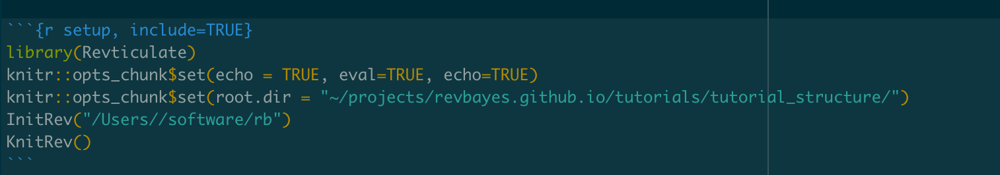



This tutorial covers how to set up files and directories to work effectively in RevBayes .
This workshop assumes no familiarity with the command line, or programming in general.
The themes of good directory structuring shown in this tutorial will be used in many othe RevBayes tutorials.  






Many of the RevBayes tutorials will as you to download data and/or scripts.
Let us begin by downloading the data and scripts associated with this tutorial.
For each tutorial that you do, you should create a _directory_, sometimes called a folder, somewhere logical on your computer.
Since we are doing the `tutorial_structure` tutorial, please title your directory `tutorial_structure`.
In this new directory, create two more directories, one called _data_ and one called _scripts_.

You will note a box called `Data files and scripts` in the upper left-hand corner of this webpage.
Please download the files listed in this directory.
Drag and drop `example_file.nex` into your `data` directory.
Then, move `test.Rev` into your `scripts` directory.
Having a directory of data that contains all your data for a project, and a directory of scripts is a good practice.
This allows you to stay organized and avoid misplacing crucial scripts in your data analysis pipeline.



Most scientific programming languages and software does not deal well with spaces in file names.
If you will be doing much scientific computing, it will be best to get in the habit of not using spaces in file and folder names.





In this section of the tutorial, we will focus on running RevBayes from your computer's graphical interface.
First, note down the location of your tutorial directory.
For example, mine is in my computer's user home, in a directory called `Tutorials`.
A graphic of this is shown in Fig. 1.


Computers do not understand the visual information of the directory structure.
Instead, we will translate this information into text.




This is an example of the Macintosh File Viewer. In this instance, I have a directoy, `Tutorials` with a subdirectory for this specific tutorial.






The home directory on a computer on a Mac is labeled with a `~/`.
Each contained directory is separated by a `/` character.
The above directory structure would be written out like so:

```
~/tutorials/tutorial_structure/
```
{:.bash}

Note down where you have your tutorial stored.

Next, we will launch RevBayes.
Do this by double-clicking on `rb`.
We will now set your working directory.
This ensures that RevBayes is aware of where in your computer your code and data are stored.
By default, RevBayes assumes you are in your user home on your computer.
Therefore, we can leave off the `~/`, as RevBayes will assume its presence.
In RevBayes, use the `setwd()` command in conjunction with your path to your tutorial to set your working directory.
For example, my command will look like so:

```
setwd("Tutorials/tutorial_structure/")
```
{:.bash}

Finally, test your working directory like so:

```
 source("scripts/test.Rev")
```

If everything has suceeded, you will see the following output:


```
   Processing file "scripts/test.Rev"
   Hi there! Welcome to RevBayes! I am now going to read in some test data.
   Successfully read one character matrix from file 'data/primates_and_galeopterus_cytb.nex'
   Congratulations, you set up your scripts and code directories correctly.
```
{:.Rev-output}


If you were not able to successfully execute the script, the most common culprit is that RevBayes is not executing from where you think. Try running getwd() and making sure that your starting working directory is what you think it is.




The home directory on a computer on a Windows is labeled as `c:`.
Each contained directory is separated by a `\\` character.
The above directory structure would be written out like so:

```
"c:\\april\\tutorials\\tutorial_structure"
```
{:.bash}

Note down where you have your tutorial stored.

Next, we will launch RevBayes.
Do this by double-clicking on `rb`.
We will now set your working directory.
This ensures that RevBayes is aware of where in your computer your code and data are stored.
In RevBayes, use the `setwd()` command in conjunction with your path to your tutorial to set your working directory.
For example, my command will look like so:

```
setwd("c:\\april\\tutorials\\tutorial_structure")
```

Finally, test your working directory like so:

```
 source("scripts/test.Rev")
```

If everything has suceeded, you will see the following output:


```
   Processing file "scripts/test.Rev"
   Hi there! Welcome to RevBayes! I am now going to read in some test data.
   Successfully read one character matrix from file 'data/primates_and_galeopterus_cytb.nex'
   Congratulations, you set up your scripts and code directories correctly.
```
{:.Rev-output}



Linux users must access RevBayes via the command line interface.




Many RevBayes users may want to use RevBayes from the `command-line interface`.
This technology allows users to interact directly with the computer's file system.
It is the predominant way many remote servers and supercomputers are used.


Linux and Macintosh users have a command line interface by default on their machines. Windows users will have to install one. A common command line interface is [Git For Windows](https://gitforwindows.org/).





Many of the RevBayes tutorials will as you to download data and/or scripts.
Let us begin by downloading the data and scripts associated with this tutorial.
For each tutorial that you do, you should create a _directory_, sometimes called a folder, somewhere logical on your computer.
Since we are doing the `tutorial_structure` tutorial, please title your directory `tutorial_structure`.
In this new directory, create two more directories, one called _data_ and one called _scripts_.


Most scientific programming languages and software does not deal well with spaces in file names.
If you will be doing much scientific computing, it will be best to get in the habit of not using spaces in file and folder names.


You will note a box called `Data files and scripts` in the upper left-hand corner of this webapge.
Please download the files listed in this directory.
Drag and drop `primates_and_galeopterus_cytb.nex` into your `data` directory.
Then, move `test.Rev` into your `scripts` directory.

Having a directory of data that contains all your data for a project, and a directory of scripts is a good practice.
This allows you to stay organized and avoid misplacing crucial scripts in your data analysis pipeline.



In this section of the tutorial, we will focus on running RevBayes from your computer's graphical interface.
First, note down the location of your tutorial directory.
For example, mine is in my laptop's shared drive, in a directory called `tutorials`.
This can be seen in 

Computers do not understand the visual information of the directory structure.
Instead, we will translate this information into text.




This is an example of the Macintosh File Viewer. In this instance, I have a directoy, `tutorials` with a subdirectory for this specific tutorial.






The home directory on a computer on in a terminal is labeled with a `~/`.
Each contained directory is separated by a `/` character.
The above directory structure would be written out like so:

```
~/Tutorials/tutorial_structure/
```
{:.bash}

Open your terminal application. Change directories into the tutorial directory with  the terminal's `cd` command. For example, my command will be:

```
cd ~/Tutorials/tutorial_structure/
```


Next, we will launch RevBayes. First, note where RevBayes is stored on your computer.

For example, my copy of RevBayes is stored a software directory in my user home.
Therefore, to launch my RevBayes, I will type:
```
~/software/rb
```

Finally, test your working directory like so:

```
 source("scripts/test.Rev")
```

If everything has suceeded, you will see the following output:


```
   Processing file "scripts/test.Rev"
   Hi there! Welcome to RevBayes! I am now going to read in some test data.
   Successfully read one character matrix from file 'data/primates_and_galeopterus_cytb.nex'
   Congratulations, you set up your scripts and code directories correctly.
```
{:.Rev-output}



The `System Path` tells your computer default locations to look for pieces of software.
If a piece of software is added to the path, it can be found and launched from anywhere on the computer.
This is beyond the scope of this tutorial, but information is readily available on doing this from other sources. If RevBayes is in your path, it can be executed by simply typing `rb` on Windows or `./rb` on Mac or Linux.





We will first launch RevBayes.
Open your terminal application.
See the aside `Command Line on Windows` for more information on this point.
Note where RevBayes is stored on your computer.

For example, my copy of RevBayes is stored a software directory in my user home.
Therefore, to launch my RevBayes, I will type:
```
~/software/rb
```

Next, we will set our working directory.
Windows will not pick up file paths from the environment in the same way Mac and Linux will.
Therefore, we will need to write out our directories, separated by `\\` characters.
My tutorial directory, as shown in Figure 1, will be written out as:

```
setwd("c:\\april\\tutorials\\tutorial_structure")
```


Finally, test your working directory like so:

```
 source("scripts/test.Rev")
```

If everything has succeeded, you will see the following output:


```
   Processing file "scripts/test.Rev"
   Hi there! Welcome to RevBayes! I am now going to read in some test data.
   Successfully read one character matrix from file 'data/primates_and_galeopterus_cytb.nex'
   Congratulations, you set up your scripts and code directories correctly.
```
{:.Rev-output}




Many RevBayes users may want to use RevBayes through RStudio , a popular graphical interface for R.
R is a fairly common computing language in biology.
In this section of the tutorial, we will focus on running RevBayes from RStudio. Once you've followed the RStudio instructions on the [installs page](https://revbayes.github.io/gui-setup), you can run use Rev language as you would in a standard RMarkown document.

RStudio has an interface with four panes: the editor (upper left), console (lower left), environment (upper right), and files (lower right).
This can be seen below



A sample RStudio window.




In the upper-right hand panel, start a new RMarkdown document. RMarkdown is used via "chunks", or  lines of code. In a new RMarkdown notebook, the first cell is shown in 




The first cell of an RMarkdown notebook.



We will edit this cell to add two variables, the root directory and the engine.path. The working directory tells R what directory you want to work in. We will set this equal to the directory to which we downloaded the data and scripts. For example, if the directory structure if as shown in figure , this line will be `knitr::opts_chunk$set(root.dir = "~/projects/tutorials/tutorial_structure/)` on Mac and Linux. On PC, it will be `setwd("c:\\april\\tutorials\\tutorial_structure")`.

The engine.path is where RevBayes is on your computer. If my copy of RevBayes is in a directory called "software" in my user home, my enine path will be `knitr::opts_chunk$set(engine.pat="~/software/rb")` on Mac and Linux or `knitr::opts_chunk$set(engine.path="c:\\april\\software\\rb")` on PC.

The appearance of the setup cell can be seen below.




This setup cell shows an example of setting the work directory and the engine path (to tell R where RevBayes is located).




Run this chunk by clicking the green arrow in the upper-left hand corner of the cell.

Next, you will note other RMarkdown chunks in the document. By changing the `r` in the curly braces to `rb`, we can run RevBayes in a markdown document. By choosing `r` or `rb`, we can use both the R programming language and RevBayes in the same notebook.




This is an example of a Rev Markdown cell inside an RMarkdown document.




```{rb}
variable <- "Hi there! Welcome to RevBayes! I am now going to read in some test data."

variable
```

Run it by clicking the green arrow. If this execute correctly, you will receive the message.

```
   Processing file "scripts/test.Rev"
   Hi there! Welcome to RevBayes! I am now going to read in some test data.
```


Now, we'll actually read in the data. Start a new Markdown chunk and enter:

```
molecular <- readDiscreteCharacterData("data/example_file.nex")

success <- "Congratulations, you set up your scripts and code directories correctly."

success
q()
```

If this executes correctly, you will receive the output:

```
   Successfully read one character matrix from file 'data/primates_and_galeopterus_cytb.nex'
   Congratulations, you set up your scripts and code directories correctly.
```

If you have made a mistake and need to erase previous output, you can add a flag to the markdown cells that refreshes previously-entered commands, as shown in figure .





This is an example of how to reset after making a mistake.




Lastly, the entire document can be `knitted` to an output file. At the top of your screen, there is a button labeled Knit. This allows you to run all of your code and save the text, output, and figures to html, PDF, and other formats.



Jupyter  is a popular interface for programming in python, though it implements numerous other languages. Once you have completed the instructions on the [installs page](https://revbayes.github.io/gui-setup), you will be able to choose RevBayes as a possible language. An example of this is below.




This is a Jupyter notebook with the language set to Rev.




Once the language is set to Rev, all cells in the notebook will execute using RevBayes. Example notebooks can be found in the [notebooks](https://github.com/revbayes/RevNotebooks) repository.
