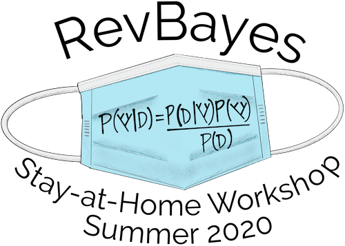

## Tutorials

1. [Introduction to MCMC using RevBayes]({{ site.baseurl }}/tutorials/mcmc/binomial.html)
2. [Nucleotide substitution models]({{ site.baseurl }}/tutorials/ctmc)
3. [Partitioned data analysis]({{ site.baseurl }}/tutorials/partition)
4. [Estimating a Time-Calibrated Phylogeny of Fossil and Extant Taxa using Morphological Data]({{ site.baseurl }}/tutorials/fbd_simple)
5. [Bayesian polymorphism-aware phylogenetic inference]({{ site.baseurl }}/tutorials/pomos)
6. [Convergence assessment]({{ site.baseurl }}/tutorials/convergence)
7. [Introduction to Posterior Prediction]({{ site.baseurl }}/tutorials/intro_posterior_prediction)
8. [Introduction to RevGadgets]({{ site.baseurl }}/tutorials/intro/revgadgets.html) 
9. [Additional tutorials]({{ site.baseurl }}/tutorials) (optional)

## Videos

1. [RevBayes Intro to MCMC](https://www.youtube.com/playlist?list=PLztACvN0g42u14RIxHqvSSfaNfxzyq4Gb)
2. [RevBayes Substitution Models](https://www.youtube.com/playlist?list=PLztACvN0g42t9pLJpeUel-ynfuNdWOsa4)
3. [RevBayes Partitioned Data Analysis](https://www.youtube.com/playlist?list=PLztACvN0g42sOcNS3dEYD3NAnHoFqDkFX)
4. [RevBayes FBD Tutorial](https://www.youtube.com/playlist?list=PLztACvN0g42t5ji1PRUdOPbhWoBwKe6Ve)
5. [RevBayes Convergence Assessment](https://www.youtube.com/playlist?list=PLztACvN0g42tn40Hg0KLRfyljtybhWlUV)
6. [RevBayes Intro to Posterior Prediction](https://www.youtube.com/playlist?list=PLztACvN0g42vs7ivZvkyAaOR1Gay1LsAn)
7. [History of Phylogenetic Comparative Methods](https://www.youtube.com/watch?v=xl317lwY2Rg)
8. [Introduction to RevGadgets](https://www.youtube.com/watch?v=lf7JAKYjFQA)
9. [RevBayes BiSSE Tutorial](https://www.youtube.com/watch?v=kYT74DTrong)

## Workshop Code of Conduct

All attendees and instructors will have to agree to the terms outlined in the workshop code of conduct. 

The code of conduct for the previous edition of the workshop can be found [here](https://drive.google.com/file/d/1XHeS8wmRy_sezBdt_rMXWAkVkAi0Pyj8/view?usp=sharing).

<!-- ## Workshop SWAG

Purchase t-shirts, stickers, mugs, etc. with the workshop logo on <a href="https://www.redbubble.com/shop/ap/54795131?ref=studio-promote">Redbubble</a>!

 -->
